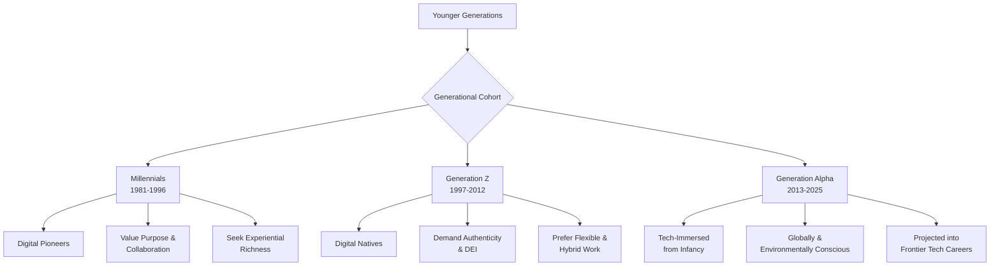

    

<h1 align="center">INSTITUTIONAL TO INDUSTRIAL TRANSITION!</h1>
<h3 align="center">A FOUNDATIONAL FRAMEWORK FOR WORKFORCE TRANSFORMATION.</h3>

  

    

    

**The contemporary professional landscape is characterized by a pervasive and critical disjuncture between the foundational knowledge imparted by academic institutions and the dynamic, applied competencies demanded by modern industry. This chasm often leaves emerging talent underprepared for the realities of the corporate world, while simultaneously leaving businesses without a reliable pipeline of truly "corporate-ready" professionals. The Institutional to Industrial Transition (I2IT) program is a strategic, holistic intervention designed to bridge this divide. I2IT is not merely a training course; it is a comprehensive ecosystem-building initiative that empowers the next generation of both employers and employees, fostering a symbiotic relationship that drives sustainable growth, innovation, and socioeconomic equilibrium. Through its unique dual-track framework, I2IT simultaneously cultivates visionary leadership and a high-performance workforce, creating a powerful engine for collective prosperity.**

**The Dual-Track Framework of Excellence:** The core innovation of the I2IT program lies in its dual-track methodology, which addresses both sides of the employment equation to achieve true industry equilibrium.

*   **The Employer Module:** This track is meticulously designed for future business leaders and entrepreneurs. It focuses on equipping them with the robust capabilities required to launch, scale, and sustain successful enterprises. This includes strategic foresight, operational management, financial acumen, and the leadership principles necessary to cultivate a thriving organizational culture.

*   **The Employee Module:** This track is dedicated to developing a high-caliber, corporate-ready workforce. It moves beyond theoretical knowledge to instill advanced technical proficiency, adaptable soft skills, and a deep-seated commitment to workplace excellence. Participants are groomed to contribute effectively from their first day on the job, accelerating their integration and value generation.

**Addressing the Core Transitional Challenges:** The transition from an institutional (academic) environment to an industrial (corporate) one presents a universal set of challenges that can hinder early-career success and confidence. The I2IT program is engineered to diagnose and mitigate these specific points of friction, which include:

*   Navigating workplace etiquette and unspoken corporate protocols.
*   Managing time pressure and stress in a high-stakes environment.
*   Building confidence in professional articulation and communication.
*   Understanding fundamental financial terms and business concepts.
*   Gaining awareness of business customers, competitive landscapes, and market dynamics.

Our mission is to transform young talents by equipping them with the essential **mindset, skillset, and toolkit** required not just to secure a role, but to excel within it, thereby making them **100% Corporate-Ready**.

**A Customized and Outcome-Oriented Training Lifecycle:** We recognize that a one-size-fits-all approach is ineffective. Therefore, the I2IT program is delivered through a rigorous, five-phase training lifecycle, customized to the specific function, seniority level, and desired outcomes of the learners and their organizations.

*   **DIAGNOSE:** We conduct a thorough analysis to identify specific skill gaps and transitional challenges.
*   **DESIGN:** We architect a tailored curriculum and learning path to address the diagnosed needs.
*   **DEVELOP:** We build and refine the executable strategy and learning modules.
*   **DELIVER:** We implement the program through engaging and impactful training sessions.
*   **DEPLOY:** We ensure the successful integration of learners into the live market, equipped for immediate contribution.

**Tangible Program Outcomes:** Upon successful completion of the I2IT program, participants will be uniquely positioned to excel. They will be able to:

*   Understand and adeptly navigate the complexities of the corporate environment.
*   Exhibit enhanced confidence, professionalism, and a positive impact in their chosen fields.
*   Apply critical thinking and problem-solving skills to real-world business scenarios.
*   Communicate with effectiveness and present themselves as consummate professionals.
*   Manage stress and time efficiently, thereby enhancing personal and team productivity.
*   Possess a solid foundation in business acumen, teamwork, and leadership principles.

**The Broader Context: Solving the Generational Career Readiness Crisis:** The I2IT program is a direct response to a complex, multi-faceted challenge. The career pathways for contemporary youth are shaped by an intricate interplay of internal factors (skills, passions, values, mindset) and external forces (societal pressures, technological disruption, economic conditions). Generational cohorts—from Millennials and Generation Z to the emerging Generation Alpha—bring distinct expectations, from a demand for purposeful work and technological integration to a heightened social and environmental consciousness.

The I2IT curriculum is designed with these nuances in mind, proactively bridging critical skill gaps by focusing on holistic competency development. We go beyond technical training to cultivate the higher-order skills—such as complex communication, adaptive resilience, and emotional intelligence—that are imperative for long-term employability. Furthermore, the program mitigates pervasive career challenges by fostering a growth mindset, building resilience against imposter syndrome, and providing strategies for burnout prevention.

**The Institutional to Industrial Transition (I2IT) program represents a forward-looking, strategic commitment to human capital development. By aligning individual aspirations with industry needs through a structured, dual-track framework, I2IT transforms the precarious "transition" from campus to corporate into a confident and purposeful "launch," empowering individuals and organizations to not only navigate the future of work but to actively shape it.**

  

> **Disclaimer — please read before using the table:** The figures in the table are approximate estimates compiled from multiple public sources (visualizations, news outlets, reference sites and national data) and reflect broad 2025-era estimates and older census-derived percentages where noted. Numbers have been rounded and may mix different counting methods (native speakers vs. total speakers including second-language users); the “% of population (mother-tongue)” values refer to India-specific mother-tongue shares (largely based on census and related estimates). Language boundaries, dialect classifications and data-collection methods vary by source, so the table is intended for general reference and overview only — not as a definitive or authoritative source for legal, academic, or policy decisions. If you need a fully cited, source-by-source version or official census figures, I can prepare that next.

    

<h1 align="center">I2IT GLOBAL</h1>

 
 
| S.No. | Language (Script)      | Phonetic Rendering (sounds like English)               | Approx. No. of Speakers | Key Regions / Countries                          | Approx. % of Population (Mother Tongue) |
| ----: | ---------------------- | ------------------------------------------------------ | ----------------------- | ------------------------------------------------ | --------------------------------------- |
|     1 | **Hindi (हिंदी)**      | इन्स्टिट्यूशनल टू इंडस्ट्रियल ट्रांज़िशन               | ~ 609 million           | India, Nepal, Mauritius, Fiji                    | ~43.63% (India)                         |
|     2 | **Bengali (বাংলা)**    | ইনস্টিটিউশনাল টু ইন্ডাস্ট্রিয়াল ট্রানজিশন             | ~ 284 million           | Bangladesh, India (West Bengal, Tripura)         | ~8.03% (India)                          |
|     3 | **Marathi (मराठी)**    | इन्स्टिट्यूशनल टू इंडस्ट्रियल ट्रान्झिशन               | ~ 85 million            | India (Maharashtra, Goa)                         | ~6.86%                                  |
|     4 | **Telugu (తెలుగు)**    | ఇన్స్టిట్యూషనల్ టు ఇండస్ట్రియల్ ట్రాన్సిషన్            | ~ 83 million            | India (Andhra Pradesh, Telangana)                | ~6.70%                                  |
|     5 | **Tamil (தமிழ்)**      | இன்ஸ்டிட்யூஷனல் டூ இண்டஸ்ட்ரியல் ட்ரான்ஸிஷன்           | ~ 78 million            | India (Tamil Nadu), Sri Lanka, Singapore         | ~5.70%                                  |
|     6 | **Gujarati (ગુજરાતી)** | ઇન્સ્ટિટ્યુશનલ ટુ ઇન્ડસ્ટ્રિયલ ટ્રાન્ઝિશન              | ~ 60 million            | India (Gujarat), diaspora in UK, US, East Africa | ~4.58%                                  |
|     7 | **Urdu (اردو)**        | انسٹیٹیوشنل ٹو انڈسٹریل ٹرانزیشن                       | ~ 230 million           | Pakistan, India, diaspora worldwide              | ~4.19% (India)                          |
|     8 | **Kannada (ಕನ್ನಡ)**    | ಇನ್ಸ್ಟಿಟ್ಯೂಶನಲ್ ಟು ಇಂಡಸ್ಟ್ರಿಯಲ್ ಟ್ರಾನ್ಸಿಷನ್            | ~ 48 million            | India (Karnataka)                                | ~3.61%                                  |
|     9 | **Odia (ଓଡ଼ିଆ)**       | ଇନ୍‌ସ୍ଟିଟ୍ୟୁସନାଲ୍ ଟୁ ଇଣ୍ଡଷ୍ଟ୍ରିଆଲ୍ ଟ୍ରାନ୍ଜିସନ୍         | ~ 38 million            | India (Odisha)                                   | ~3.10%                                  |
|    10 | **Malayalam (മലയാളം)** | ഇന്‍സ്റ്റിറ്റ്യൂഷണല്‍ ടു ഇന്‍ഡസ്ട്രിയല്‍ ട്രാന്‍സിഷന്‍ | ~ 35 million            | India (Kerala), Gulf diaspora                    | ~2.88%                                  |
|    11 | **Punjabi (ਪੰਜਾਬੀ)**   | ਇਨਸਟੀਟਿਊਸ਼ਨਲ ਟੂ ਇੰਡਸਟ੍ਰੀਅਲ ਟ੍ਰਾਂਜ਼ਿਸ਼ਨ                 | ~ 125 million           | India (Punjab), Pakistan (Punjab), diaspora      | ~2.74% (India)                          |
|    12 | **Assamese (অসমীয়া)** | ইনস্টিটিউশনাল টু ইণ্ডাষ্ট্রিয়েল ট্রানজিশন             | ~ 23 million            | India (Assam)                                    | ~1.26%                                  |
|    13 | **Maithili (मैथिली)**  | इन्स्टिट्यूशनल टू इंडस्ट्रियल ट्रांज़िशन               | ~ 15 million            | India (Bihar), Nepal                             | ~1.12%                                  |
|    14 | **Nepali (नेपाली)**    | इन्स्टिट्यूशनल टू इंडस्ट्रियल ट्रांज़िशन               | ~ 25 million            | Nepal, India (Darjeeling, Sikkim)                | ~0.24%                                  |
|    15 | **Konkani (कोंकणी)**   | इन्स्टिट्यूशनल टू इंडस्ट्रियल ट्रांज़िशन               | ~ 3 million             | India (Goa, coastal Karnataka)                   | ~0.19%                                  |
|    16 | **English (Latin)**    | INSTITUTIONAL TO INDUSTRIAL TRANSITION                 | ~ 1,500 million         | Worldwide (US, UK, Canada, Australia, India)     | —                                       |
|    17 | **Spanish (Latin)**    | INSTITUTIONAL TO INDUSTRIAL TRANSITION                 | ~ 558 million           | Spain, Mexico, Latin America, US                 | —                                       |
|    18 | **French (Latin)**     | INSTITUTIONAL TO INDUSTRIAL TRANSITION                 | ~ 312 million           | France, Belgium, Canada, Africa                  | —                                       |
|    19 | **German (Latin)**     | INSTITUTIONAL TO INDUSTRIAL TRANSITION                 | ~ 134 million           | Germany, Austria, Switzerland                    | —                                       |
|    20 | **Portuguese (Latin)** | INSTITUTIONAL TO INDUSTRIAL TRANSITION                 | ~ 267 million           | Brazil, Portugal, Angola, Mozambique             | —                                       |
|    21 | **Italian (Latin)**    | INSTITUTIONAL TO INDUSTRIAL TRANSITION                 | ~ 66 million            | Italy, Switzerland, diaspora                     | —                                       |
|    22 | **Russian (Русский)**  | Институционал ту Индастриал Транзишн                   | ~ 253 million           | Russia, Belarus, Central Asia                    | —                                       |
|    23 | **Arabic (العربية)**   | انستيتيوشنال تو اندستريال ترانزيشن                     | ~ 335 million           | Middle East, North Africa                        | —                                       |
|    24 | **Hebrew (עִבְרִית)**  | אינסטיטושנל טו אינדסטריאַל טראנזישן                    | ~ 9 million             | Israel                                           | —                                       |
|    25 | **Japanese (カタカナ)**    | インスティテューショナル トゥ インダストリアル トランジション                       | ~ 126 million           | Japan                                            | —                                       |
|    26 | **Korean (한국어)**       | 인스티튜셔널 투 인더스트리얼 트랜지션                                   | ~ 82 million            | South & North Korea                              | —                                       |
|    27 | **Chinese (简体中文)**     | 因斯蒂图申 图 因达斯特里尔 特兰西申                                    | ~ 1,180 million         | China, Taiwan, Singapore                         | —                                       |

    

<h1 align="center">A STRATEGIC FRAMEWORK FOR UNDERSTANDING CAREER DYNAMICS, BRIDGING SKILL GAPS, AND OVERCOMING CAREER CHALLENGES FOR THE EMERGING GENERATION.</h1>

#### Executive Summary:

Career selection for contemporary youth is not a singular event but a continuous, adaptive process shaped by a complex interplay of personal attributes, social influences, structural constraints, and rapid technological and economic change. This refined, deployment-ready document synthesizes the principal internal and external drivers that inform career selection; identifies persistent and emergent skill gaps; describes concomitant psychological and structural barriers; and presents concrete, actionable interventions for educators, employers, policymakers, and young people themselves. It concludes with an implementation roadmap and monitoring framework designed for immediate adoption to foster resilient career development and a more agile workforce.

 

#### 1. Introduction: Navigating the Modern Career Labyrinth:

For the current young cohorts—Millennials, Generation Z, and the emergent Generation Alpha—navigating a career pathway resembles traversing a dynamic labyrinth rather than following a linear track. The decision to enter, persist in, pivot from, or re-skill for a given occupation is shaped by an interlocking set of **internal dispositions** (skills, values, mindset), **external influences** (family, economy, technology, policy), and **situational variables** (geography, health, financial pressures). The convergence of these forces determines whether a career culminates in profound fulfillment or persistent frustration. A rigorous understanding of these interacting factors is a prerequisite for effective intervention. This document provides that foundational analysis and translates it into operational guidance: curricular design principles, employer practices, policy levers, and individual strategies that are actionable, measurable, and designed to empower the next generation to thrive in the ever-evolving future of work.

 

#### 2. The Multidimensional Factors Influencing Career Choices:

Career decisions are forged at the intersection of an individual's internal compass and the external contextual landscape. A holistic understanding requires examining both domains.

**2.1. Internal Factors: The Personal Compass:** These are the intrinsic attributes that guide an individual toward certain fields and away from others, acting as both attractors and filters.

*   **Skills and Abilities:** A realistic appraisal of both hard skills (technical competence, domain knowledge) and soft skills (communication, teamwork, cognitive flexibility) is central to matching individuals with suitable roles.
*   **Interests and Passions:** Sustained intrinsic motivation, derived from genuine curiosity and enthusiasm, is a powerful predictor of long-term engagement, creativity, and job satisfaction.
*   **Personality and Working Style:** Dispositional characteristics, such as introversion/extroversion and tolerance for ambiguity, profoundly influence occupational compatibility and environmental fit.
*   **Values and Ethical Priorities:** Core principles—such as environmental stewardship, social justice, work-life integration, or financial security—increasingly serve as non-negotiable filters for employer and sector selection.
*   **Mindset and Resilience:** Adopting a growth mindset—the conviction that abilities can be developed—empowers individuals to pursue ambitious paths and persevere through adversity.
*   **Health and Well-being:** Physical vitality and psychological wellness are critical considerations, often directing individuals toward roles with adaptable schedules and supportive cultures.
*   **Learning Preferences:** Cognitive preferences (e.g., kinesthetic, auditory, visual) influence optimal pathways for skill acquisition and professional development.
*   **Life Goals and Aspirations:** Long-term objectives, such as financial independence, entrepreneurial autonomy, or family stability, serve as the overarching framework guiding strategic career decisions.

**2.2. External Factors: The Contextual Landscape:** These are the environmental and systemic forces that create opportunity structures and constraints, which must be addressed at a systemic level.

The table below summarizes these external factors and their implications:

| External Factor | Impact on Career Choice | Strategic Implication |
| :--- | :--- | :--- |
| **Family & Parental Influence** | Can provide support or impose constraints through expectations and traditions. | Develop family-inclusive career guidance programs to align expectations with market realities. |
| **Peer & Social Media Influence** | Sets perceived benchmarks for success; can inspire or create unrealistic pressure. | Integrate digital and media literacy training to foster critical evaluation of career narratives. |
| **Educational Access & Quality** | Determines exposure to fields, mentors, and practical experiences; a primary source of disparity. | Drive curriculum modernization, mandate internships, and fund equitable access to high-quality resources. |
| **Economic Conditions** | Dictates labor market demand, salary viability, and the appeal of stable vs. gig work. | Develop regional economic strategies and support systems for mobility and reskilling. |
| **Technological Advancements** | Continuously redefines the occupational ecosystem, creating new fields and rendering others obsolete. | Embed future-focused, technology-aware pedagogy and continuous learning infrastructures. |
| **Government Policies & Programs** | Shapes workforce development through scholarships, training incentives, and labor regulations. | Create coordinated policy frameworks that support apprenticeships and recognize micro-credentials. |
| **Networking & Professional Capital** | Serves as a critical conduit for opportunity discovery, mentorship, and advancement. | Establish structured, employer-led mentorship networks and subsidized industry immersion programs. |
| **Geographical Location** | Historically dictated local opportunities, though remote work is progressively decoupling access from proximity. | Invest in digital infrastructure and create local innovation hubs to foster hybrid work opportunities. |

 

#### 3. Generational Nuances and Operational Consequences:

While avoiding over-generalization, understanding cohort-level tendencies allows for the tailoring of effective interventions.

 

#### 4. Identifying and Bridging Critical Skill Gaps:

A persistent mismatch exists between the skills possessed by new labor market entrants and those demanded by the modern economy. The following table maps these gaps to precise, actionable remedies.

| Skill Gap Category | Manifestation | Educational Response | Employer Response |
| :--- | :--- | :--- | :--- |
| **Applied Technical Skills** | Inability to perform core technical tasks without significant re-training. | Integrate industry-co-designed capstone projects and mandatory, hands-on labs. | Fund paid apprenticeships and structured on-the-job bootcamps. |
| **Digital Literacy & Fluency** | Low proficiency with essential collaboration, analytics, and productivity platforms. | Embed tool-specific modules and sandboxed project work into core curricula. | Provide dedicated training on internal systems and software. |
| **Complex Communication** | Difficulty with cross-functional collaboration, stakeholder management, and persuasive presentation. | Teach rhetorical skills, technical writing, and storytelling through applied assignments. | Implement rotational programs and host presentation clinics. |
| **Critical & Systems Thinking** | Tendency toward surface-level problem-solving; difficulty analyzing complex systems. | Utilize problem-based learning (PBL) and systems modeling projects across disciplines. | Form cross-disciplinary teams to tackle complex business challenges. |
| **Emotional Intelligence & Resilience** | Increased burnout, difficulty managing conflict, and challenges with adaptive response. | Integrate Social-Emotional Learning (SEL) and stress-management training. | Train managers in psychological safety and ensure realistic workload design. |
| **Lifelong Learning Habits** | Skill obsolescence due to a lack of self-directed learning routines. | Offer micro-credential pathways and promote stackable certifications. | Provide learning stipends, dedicated learning hours, and tie promotions to skill development. |

 

#### 5. Mitigating Pervasive Career Challenges: 

Psychological barriers and structural inequities often impede career progression. Effective strategies must address both.

**5.1. Overcoming Psychological Barriers:**

*   **Countering Imposter Syndrome:** Implement structured mentorship and sponsorship programs. Foster a culture that celebrates incremental progress and normalizes the developmental nature of expertise.
*   **Alleviating Fear of Failure:** Cultivate psychologically safe environments where calculated risk-taking is encouraged. Integrate design-thinking and iterative prototyping methodologies to frame setbacks as essential learning inputs.
*   **Preventing and Addressing Burnout:** Institutionalize flexible scheduling, mandatory disconnection periods, and robust mental health resources. Provide training in time management, boundary setting, and prioritization.

**5.2. Dismantling Structural Barriers:**

*   **Promoting Equitable Access and Inclusion:** Employ bias-mitigated hiring processes (e.g., structured interviews, work-sample tests). Establish comprehensive support networks (e.g., Employee Resource Groups) and ensure accessible pathways for underrepresented talent.
*   **Modernizing Credentialing:** Advocate for and recognize stackable, industry-validated micro-credentials alongside traditional degrees to create more porous and equitable pathways into careers.

**6. Call to Collective Action:** The career trajectories of today's youth are shaped by a complex tapestry of personal aspirations and powerful external forces. Understanding this intricate interplay is the essential first step. However, insight must be coupled with decisive action. A concerted, forward-looking commitment from all stakeholders is required:

*   **Educators** must evolve curricula to be experiential, industry-aligned, and focused on holistic skill cultivation.
*   **Employers** must invest in continuous learning, create inclusive and flexible work environments, and participate in building talent pipelines.
*   **Policymakers** must create the funding and regulatory frameworks that incentivize lifelong learning and equitable access.
*   **Young Professionals** must proactively engage in self-assessment, skill-building, and network cultivation.

By embracing the strategies outlined in this framework, we can collectively empower the emerging generation not merely to navigate the labyrinth of modern work, but to redesign it—fostering a future of work that is adaptive, equitable, and deeply fulfilling.

    

<h2 align="center">STAY TUNED FOR THE LATEST UPDATES!</h2>

  

    

    
